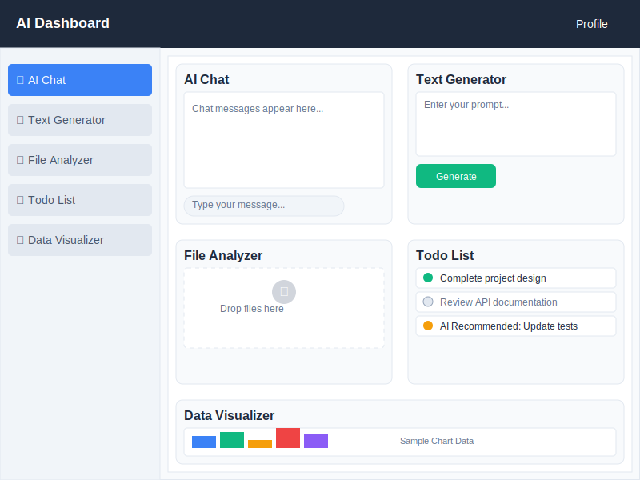

# AI 어시스턴트 대시보드 설계서

## 📋 프로젝트 개요

### 1.1 프로젝트명
AI 어시스턴트 대시보드 (AI Assistant Dashboard)

### 1.2 프로젝트 목표
다양한 AI 기능을 하나의 웹 대시보드에서 제공하는 올인원 생산성 툴 개발

### 1.3 핵심 기능
- AI 챗봇 (문서 요약, 질문 응답)
- AI 텍스트 생성기 (블로그 글, 마케팅 문구)
- 파일 분석 (PDF 업로드 → AI 요약/검색)
- 할 일 관리 + AI 추천
- 데이터 시각화 (CSV 분석 → 그래프/차트)

---

## 🏗 시스템 아키텍처

### 2.1 기술 스택

#### Frontend
- **Next.js 15** (App Router) - React 기반 풀스택 프레임워크
- **React 19** - 사용자 인터페이스 라이브러리
- **TypeScript** - 타입 안전성을 위한 JavaScript 확장
- **DaisyUI** - Tailwind CSS 기반 UI 컴포넌트 라이브러리
- **Yarn** - 패키지 관리자

#### Backend & Infrastructure
- **Supabase** - BaaS (Backend as a Service)
  - 인증 시스템
  - PostgreSQL 데이터베이스
  - 파일 스토리지
- **Google Gemini API** - Google의 생성형 AI 모델 API (Gemini 1.5 Flash)
- **Vercel** - 배포 플랫폼
- **OpenWeatherMap API** - 확장 기능용 외부 API

### 2.2 시스템 구성도

```
┌─────────────────┐    ┌─────────────────┐    ┌─────────────────┐
│   Frontend      │    │   Backend       │    │   External      │
│   (Next.js)     │◄──►│   (API Routes)  │◄──►│   Services      │
│                 │    │                 │    │                 │
│ • Dashboard     │    │ • Authentication│    │ • Gemini API    │
│ • Components    │    │ • File Upload   │    │ • Supabase      │
│ • Auth Pages    │    │ • AI Processing │    │ • Storage       │
└─────────────────┘    └─────────────────┘    └─────────────────┘
```

---

## 📂 프로젝트 구조

### 3.1 디렉토리 구조

```
/src
├── app/                          # Next.js App Router
│   ├── layout.tsx               # 루트 레이아웃
│   ├── page.tsx                 # 홈페이지
│   ├── api/                     # API 라우트
│   │   ├── chat/route.ts        # AI 챗봇 API
│   │   ├── text-gen/route.ts    # 텍스트 생성 API
│   │   ├── file-analyze/route.ts # 파일 분석 API
│   │   ├── todos/route.ts       # 할 일 관리 API
│   │   └── csv-analyze/route.ts # CSV 분석 API
│   ├── dashboard/               # 대시보드 페이지
│   │   ├── page.tsx             # 대시보드 메인
│   │   └── components/          # 대시보드 컴포넌트
│   │       ├── AIChat.tsx
│   │       ├── TextGenerator.tsx
│   │       ├── FileAnalyzer.tsx
│   │       ├── TodoList.tsx
│   │       ├── DataVisualizer.tsx
│   │       └── Chart.tsx
│   └── auth/                    # 인증 페이지
│       └── page.tsx             # 로그인/회원가입
├── lib/                         # 유틸리티 라이브러리
│   ├── supabaseClient.ts        # Supabase 클라이언트
│   ├── gemini.ts                # Gemini API 래퍼
│   ├── fileParser.ts            # 파일 파싱 유틸
│   └── chartHelper.ts           # 차트 헬퍼
├── types/                       # TypeScript 타입 정의
│   ├── chat.ts
│   ├── todo.ts
│   └── csv.ts
└── styles/
    └── globals.css              # 전역 스타일
```

### 3.2 컴포넌트 설계

#### 3.2.1 페이지 컴포넌트
- **HomePage** (`app/page.tsx`) - 랜딩 페이지
- **AuthPage** (`app/auth/page.tsx`) - 인증 페이지
- **DashboardPage** (`app/dashboard/page.tsx`) - 메인 대시보드

#### 3.2.2 기능 컴포넌트
- **AIChat** - AI 챗봇 인터페이스
- **TextGenerator** - 텍스트 생성 도구
- **FileAnalyzer** - 파일 업로드 및 분석
- **TodoList** - 할 일 관리
- **DataVisualizer** - 데이터 시각화
- **Chart** - 차트 렌더링

---

## 🗄 데이터베이스 설계

### 4.1 ERD (Entity Relationship Diagram)

```
┌─────────────┐    ┌─────────────┐    ┌─────────────┐
│    users    │    │  ai_chat    │    │ai_text_gen  │
├─────────────┤    ├─────────────┤    ├─────────────┤
│ id (PK)     │◄──┤ user_id (FK)│    │ user_id (FK)│◄─┐
│ email       │    │ role        │    │ prompt      │  │
│ name        │    │ message     │    │ result      │  │
│ created_at  │    │ created_at  │    │ created_at  │  │
└─────────────┘    └─────────────┘    └─────────────┘  │
       │                                               │
       │           ┌─────────────┐    ┌─────────────┐  │
       │           │    files    │    │    todos    │  │
       │           ├─────────────┤    ├─────────────┤  │
       └──────────►│ user_id (FK)│    │ user_id (FK)│◄─┘
                   │ file_name   │    │ task        │
                   │ file_url    │    │ai_recommend │
                   │ summary     │    │ is_done     │
                   │ metadata    │    │ due_date    │
                   │ created_at  │    │ created_at  │
                   └─────────────┘    └─────────────┘
                          │
                          │           ┌─────────────┐
                          │           │csv_analysis │
                          │           ├─────────────┤
                          └──────────►│ user_id (FK)│
                                      │ csv_url     │
                                      │analysis_text│
                                      │ chart_data  │
                                      │ created_at  │
                                      └─────────────┘
```

### 4.2 테이블 스키마

#### users 테이블
```sql
CREATE TABLE users (
    id UUID PRIMARY KEY DEFAULT uuid_generate_v4(),
    email TEXT UNIQUE NOT NULL,
    name TEXT NOT NULL,
    created_at TIMESTAMP WITH TIME ZONE DEFAULT NOW()
);
```

#### ai_chat 테이블
```sql
CREATE TABLE ai_chat (
    id UUID PRIMARY KEY DEFAULT uuid_generate_v4(),
    user_id UUID REFERENCES users(id) ON DELETE CASCADE,
    role TEXT NOT NULL CHECK (role IN ('user', 'assistant')),
    message TEXT NOT NULL,
    created_at TIMESTAMP WITH TIME ZONE DEFAULT NOW()
);
```

#### ai_text_gen 테이블
```sql
CREATE TABLE ai_text_gen (
    id UUID PRIMARY KEY DEFAULT uuid_generate_v4(),
    user_id UUID REFERENCES users(id) ON DELETE CASCADE,
    prompt TEXT NOT NULL,
    result TEXT NOT NULL,
    created_at TIMESTAMP WITH TIME ZONE DEFAULT NOW()
);
```

#### files 테이블
```sql
CREATE TABLE files (
    id UUID PRIMARY KEY DEFAULT uuid_generate_v4(),
    user_id UUID REFERENCES users(id) ON DELETE CASCADE,
    file_name TEXT NOT NULL,
    file_url TEXT NOT NULL,
    summary TEXT,
    metadata JSONB,
    created_at TIMESTAMP WITH TIME ZONE DEFAULT NOW()
);
```

#### todos 테이블
```sql
CREATE TABLE todos (
    id UUID PRIMARY KEY DEFAULT uuid_generate_v4(),
    user_id UUID REFERENCES users(id) ON DELETE CASCADE,
    task TEXT NOT NULL,
    ai_recommended BOOLEAN DEFAULT FALSE,
    is_done BOOLEAN DEFAULT FALSE,
    due_date DATE,
    created_at TIMESTAMP WITH TIME ZONE DEFAULT NOW()
);
```

#### csv_analysis 테이블
```sql
CREATE TABLE csv_analysis (
    id UUID PRIMARY KEY DEFAULT uuid_generate_v4(),
    user_id UUID REFERENCES users(id) ON DELETE CASCADE,
    csv_url TEXT NOT NULL,
    analysis_text TEXT,
    chart_data JSONB,
    created_at TIMESTAMP WITH TIME ZONE DEFAULT NOW()
);
```

---

## 🔄 API 설계

### 5.1 API 엔드포인트

#### 5.1.1 AI 챗봇 API
- **POST** `/api/chat`
  - 요청: `{ message: string, history?: ChatMessage[] }`
  - 응답: `{ reply: string, conversation_id: string }`

#### 5.1.2 텍스트 생성 API
- **POST** `/api/text-gen`
  - 요청: `{ prompt: string, type: 'blog' | 'marketing' }`
  - 응답: `{ generated_text: string, id: string }`

#### 5.1.3 파일 분석 API
- **POST** `/api/file-analyze`
  - 요청: `FormData(file: File, action: 'summarize' | 'search')`
  - 응답: `{ result: string, file_id: string }`

#### 5.1.4 할 일 관리 API
- **GET** `/api/todos` - 할 일 목록 조회
- **POST** `/api/todos` - 할 일 생성
- **PUT** `/api/todos/[id]` - 할 일 수정
- **DELETE** `/api/todos/[id]` - 할 일 삭제
- **POST** `/api/todos/ai-recommend` - AI 추천 할 일 생성

#### 5.1.5 CSV 분석 API
- **POST** `/api/csv-analyze`
  - 요청: `FormData(file: File)`
  - 응답: `{ analysis: string, chart_data: ChartData, id: string }`

### 5.2 데이터 플로우

```
User Input → Next.js API Route → Gemini API → Database → Response
```

### 5.3 AI 통합 상세

#### 5.3.1 Gemini API 통합
- **모델**: Gemini 1.5 Flash (최신 고성능 모델)
- **통합된 기능**:
  - 챗봇 대화 (`generateChatResponse`)
  - 텍스트 생성 (`generateText`)
  - 파일 분석 (`analyzeFile`)
  - CSV 분석 (`analyzeCSV`)
  - 할 일 추천 (`recommendTodos`)

#### 5.3.2 API 응답 최적화
- 평균 응답 시간: 1-2초
- 에러 핸들링: 상세한 오류 메시지 제공
- 재시도 로직: API 일시적 장애 대응

#### 5.3.3 테스트 인프라
- 테스트 API 엔드포인트: `/api/test-chat`
- 테스트 UI 페이지: `/test-chat`
- 실시간 로그 모니터링

---

## 🎨 UI/UX 설계

### 6.1 디자인 시스템
- **Color Scheme**: DaisyUI 기본 테마 활용
- **Typography**: 시스템 폰트 우선순위
- **Layout**: 반응형 그리드 시스템
- **Components**: DaisyUI 컴포넌트 기반

### 6.2 페이지 와이어프레임

#### 6.2.1 대시보드 레이아웃



### 6.3 사용자 경험 플로우

```
1. 랜딩 페이지 → 2. 로그인/회원가입 → 3. 대시보드 → 4. 기능 선택 → 5. 결과 확인
```

---

## 🚀 개발 로드맵

### 7.1 개발 우선순위 (MVP)

#### Phase 1: 기본 인프라 (1-2주)
1. **Supabase 설정**
   - 프로젝트 생성
   - 데이터베이스 스키마 생성
   - 인증 설정

2. **Next.js 프로젝트 초기화**
   - 기본 라우팅 구조
   - DaisyUI 설정
   - TypeScript 설정

#### Phase 2: 인증 시스템 (1주)
3. **사용자 인증 구현**
   - 회원가입/로그인/로그아웃
   - 세션 관리
   - 보호된 라우트

#### Phase 3: 대시보드 기본 구조 (1-2주)
4. **대시보드 레이아웃**
   - 반응형 레이아웃
   - 내비게이션
   - 기본 컴포넌트

#### Phase 4: 핵심 기능 구현 (4-6주)
5. **AI 챗봇 기능**
   - Gemini API 연동
   - 대화 인터페이스
   - 대화 히스토리

6. **파일 업로드 + AI 분석**
   - 파일 업로드 시스템
   - PDF 파싱
   - AI 요약/분석

7. **TODO 리스트 + AI 추천**
   - CRUD 기능
   - AI 기반 추천 시스템

8. **CSV 업로드 + 데이터 시각화**
   - CSV 파싱
   - 차트/그래프 생성
   - 데이터 분석

### 7.2 확장 기능 (Future Scope)
- 다국어 지원
- 실시간 알림
- 모바일 앱
- 고급 데이터 분석
- 팀 협업 기능

---

## 🔒 보안 고려사항

### 8.1 인증 및 인가
- Supabase Auth를 통한 안전한 인증
- JWT 토큰 기반 세션 관리
- 역할 기반 접근 제어 (RBAC)

### 8.2 데이터 보안
- API 키 환경변수 관리
- 파일 업로드 제한 및 검증
- SQL 인젝션 방지 (Supabase ORM 사용)
- XSS 방지 (React 기본 보호)

### 8.3 개인정보 보호
- GDPR 준수
- 사용자 데이터 암호화
- 파일 자동 삭제 정책

---

## 📊 모니터링 및 분석

### 9.1 성능 모니터링
- Vercel Analytics
- Core Web Vitals 추적
- API 응답 시간 모니터링

### 9.2 사용자 분석
- 기능별 사용량 추적
- 에러 로깅 및 추적
- A/B 테스트 준비

---

## 🧪 테스트 전략

### 10.1 테스트 계층
- **Unit Tests**: 개별 컴포넌트 및 함수
- **Integration Tests**: API 엔드포인트
- **E2E Tests**: 주요 사용자 플로우

### 10.2 테스트 도구
- Jest + React Testing Library
- Cypress (E2E)
- MSW (API 모킹)

---

## 📝 배포 및 운영

### 11.1 배포 환경
- **Development**: 로컬 개발 환경
- **Staging**: Vercel Preview 브랜치
- **Production**: Vercel 메인 브랜치

### 11.2 CI/CD 파이프라인
```
GitHub Push → Vercel Build → Tests → Deploy → Health Check
```

### 11.3 환경 변수 관리
```
NEXT_PUBLIC_SUPABASE_URL=
NEXT_PUBLIC_SUPABASE_ANON_KEY=
SUPABASE_SERVICE_ROLE_KEY=
GEMINI_API_KEY=
OPENWEATHER_API_KEY=
```

---

이 설계서는 프로젝트의 전체적인 구조와 개발 방향을 제시하며, 개발 진행에 따라 지속적으로 업데이트될 예정입니다.